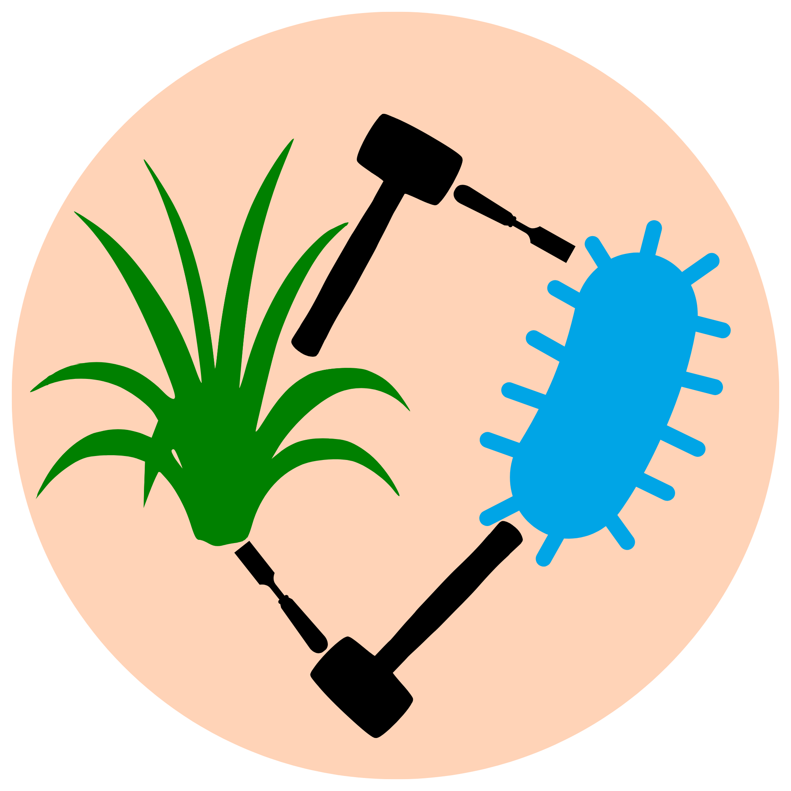
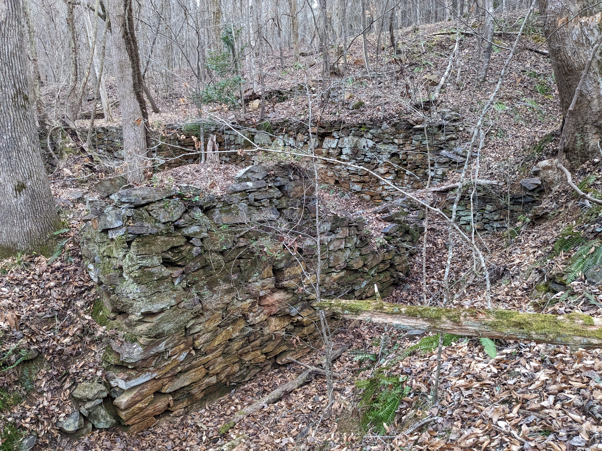

Every project needs a good acronym! Read about some of my ongoing work below.

\vspace{3em}

## SCULPTORS

##### Soil communities and understories of longleaf pine: trajectories of recovery and shrubification

::: {.column-margin}

:::

In my doctoral work, I saw that just a few years of fire suppression resulted in increased woody plant abundance in longleaf pine Sandhills communities. 
Inspired by this observation, my postdoctoral work focuses on woody plant encroachment in fire-prone savannas and grasslands.
From nitrogen-fixing acacias to ectomycorrhizal pines to *Frankia*-associating bayberries, woody encroachers tend to form beneficial rhizosphere relationships. 
Meanwhile, grasses tend to accumulate self-limiting microbial communities.
Using a combination of theoretical modeling, molecular methods, field observations, and a reciprocal transplant experiment, I am investigating the soil microbial drivers of woody plant encroachment in fire-prone longleaf pine ecosystems. 

[Watch a talk my postdoctoral advisor Gaurav Kandlikar and I jointly gave to the International Initiative for Theoretical Ecology on our modeling work here](https://www.youtube.com/watch?v=4Y0DEvDBfws)

## TRAIPSE

##### Timing, richness, abundance, and interactions of pollinators and spring ephemerals

::: {.column-margin}

:::

Timing is everything for spring ephemeral plants in deciduous forest understories. They have highly constrained windows of opportunity once temperatures are warm enough to grow but before the overstory canopy leafs out. Leveraging historical data collected by Alexander Motten, my collaborators and I are investigating shifts in the seasonal timing of growth and flowering of key spring ephemerals like *Erythronium umbilicatum* and *Claytonia virginica*, along with their population- and community-level consequences. 

[Check out a recent pre-print led by my collaborator Melina Schopler](https://www.biorxiv.org/content/10.1101/2025.05.14.652260v1)

## GOALPOST

##### Getting at order of arrival leveraging protists over sizes and temperatures

::: {.column-margin}

:::

A key criterion for coexistence is mutual invasibility -- if each species can rebound from low densities while other species are at equilibrium, then stable coexistence is possible. Priority effects, meanwhile, occur when each species excludes the other at equilibrium, resulting in a historically contingent outcome. However, historically contingent coexistence should in principle be possible if both inter- and intraspecific interactions vary with arrival order. Inspired by pitcher plant inquiline communities, my collaborator Richard Wong and I are investigating this possibility empirically using protists. 

## SCARCITY

##### Scrutinizing coexistence assumptions and resource competition in theorY

::: {.column-margin}

:::

"Ecologists have been investigating for a century how so many competing species are able to coexist." So begins many papers investigating the mechanisms underlying species coexistence, yet this apparent paradox remains unresolved. Alongside a group of ecologists interested in expanding our disciplinary horizons, I am interested in historicizing the development of coexistence theories in ecology to reveal its advances and limitations.

[Check out a paper reviewing this "diversity paradox"](https://doi.org/10.1086/720002)

## Unearthing Duke Forest

##### Not an acronym, just wordplay

::: {.column-margin}

:::

Human histories, particularly those of expulsion and exploitation, are intertwined with natural history and scientific history across the southeastern US. Taking Duke Forest as a case study, my collaborators and I explore these intertwined histories by studying classic scientific literature, visiting university and state archives, and reading the landscape itself as an archive. Inspired by Black feminist geographers' theorization of afterlives of the plantation, we investigate land use legacies in both the forest and the science. We received a Duke Provost Grant on Reckoning with Race, Racism, and the American South to develop interpretive signage at the Robeson Mill site of Duke Forest. 

[Check out our recent qualitative research investigating scientists' perceptions of history's relevance for their work](https://doi.org/10.29333/ajqr/16541)